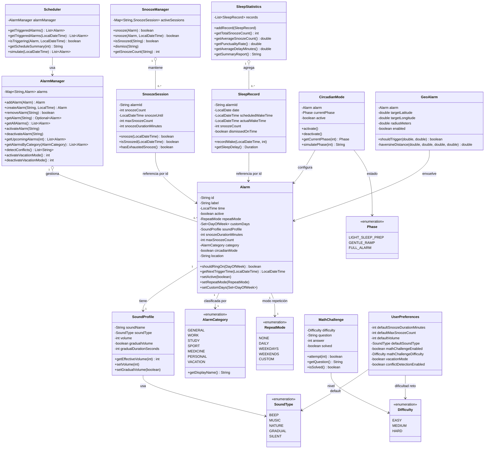

# Diagrama de Clases UML — SmartAlarm

## Diagrama

---

## Justificación del diseño

### ¿Por qué existe `SoundProfile` como clase separada?

Si el sonido estuviera dentro de `Alarm`, la clase tendría demasiadas responsabilidades. `SoundProfile` puede evolucionar de forma independiente (añadir ecualizador, playlists, fuente de streaming) sin tocar `Alarm`. Además permite reutilizar el mismo perfil en múltiples alarmas si se desea.

### ¿Por qué `SnoozeSession` está separada de `Alarm`?

Una alarma no siempre está siendo pospuesta. Crear el objeto `SnoozeSession` solo cuando hace falta evita tener estado nulo (`snoozeCount = 0`, `snoozeUntil = null`) en todas las alarmas siempre. El `SnoozeManager` crea y destruye sesiones dinámicamente.

### ¿Por qué `AlarmManager` usa `Map<String, Alarm>`?

El acceso por ID es la operación más frecuente (activar, desactivar, buscar). `LinkedHashMap` garantiza O(1) para acceso por ID y mantiene el orden de inserción para listados predecibles.

### ¿Por qué `Scheduler` está separado de `AlarmManager`?

`AlarmManager` conoce el *estado* de las alarmas. `Scheduler` conoce el *tiempo*. Son responsabilidades diferentes. Esta separación permite sustituir el `Scheduler` por uno basado en `Timer`, `ScheduledExecutorService` o similar sin tocar `AlarmManager`.

### ¿Por qué `CircadianMode` y `GeoAlarm` son clases independientes y no flags en `Alarm`?

Son *decoradores de comportamiento*. Añadir sus atributos directamente en `Alarm` inflaría la clase con campos que la mayoría de alarmas nunca usan. Como clases separadas, el patrón es extensible: mañana podría añadirse `WeatherAlarm` o `CalendarAlarm` sin modificar `Alarm`.

### ¿Por qué `SleepRecord` es inmutable (salvo `recordWake`)?

Los registros de sueño representan hechos pasados. Una vez registrado el despertar, el registro no debe cambiar. La inmutabilidad parcial (solo se escribe una vez via `recordWake`) protege la integridad histórica.

### Encapsulación de `MathChallenge`

La respuesta (`answer`) es privada y no tiene getter. La única forma de interactuar es mediante `attempt(int)`. Esto impide que código cliente haga trampa comparando la respuesta directamente.

### Visibilidad

- Todos los campos son `private`
- Los getters exponen copias defensivas donde aplica (`getCustomDays()` devuelve `EnumSet.copyOf`)
- Los setters validan los invariantes del dominio (volumen 0-100, duración snooze 1-60, etc.)
- Métodos internos de cálculo (`haversineDistance`) son `private`
