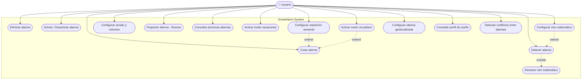

# Casos de Uso — SmartAlarm

## Diagrama de Casos de Uso

---

## Especificación de Casos de Uso

---

### UC-01: Crear Alarma

| Campo | Descripción |
|---|---|
| **Nombre** | Crear alarma |
| **Objetivo** | Añadir una nueva alarma al sistema con hora y etiqueta |
| **Actor principal** | Usuario |
| **Precondiciones** | El sistema está iniciado |

**Flujo principal:**
1. El usuario proporciona una etiqueta y una hora (HH:MM)
2. El sistema valida que la etiqueta no esté vacía y la hora sea válida
3. El sistema crea la alarma con un ID único y configuración por defecto
4. La alarma queda activa y registrada en el sistema
5. El sistema confirma la creación

**Flujos alternativos:**

- **2a** — Etiqueta vacía: el sistema rechaza con error "Label cannot be null"
- **2b** — Hora inválida: `LocalTime` lanza `DateTimeException`; el sistema informa al usuario

**Postcondiciones:** Una alarma nueva está registrada, activa, con categoría GENERAL y sin repetición

**Reglas de negocio:**
- El ID es UUID, único e inmutable
- La alarma se crea activa por defecto
- El snooze por defecto es 9 minutos, máximo 3 veces

---

### UC-02: Eliminar Alarma

| Campo | Descripción |
|---|---|
| **Nombre** | Eliminar alarma |
| **Objetivo** | Borrar permanentemente una alarma del sistema |
| **Actor principal** | Usuario |
| **Precondiciones** | Existe al menos una alarma en el sistema |

**Flujo principal:**
1. El usuario selecciona la alarma a eliminar (por ID o referencia)
2. El sistema localiza la alarma
3. El sistema elimina la alarma
4. El sistema confirma la eliminación devolviendo `true`

**Flujos alternativos:**

- **2a** — ID no encontrado: el sistema devuelve `false` sin error

**Postcondiciones:** La alarma ya no existe en el sistema; no puede recuperarse

**Reglas de negocio:**
- La eliminación es permanente (no hay papelera)
- Las sesiones de snooze activas asociadas deben ser limpiadas

---

### UC-03: Activar / Desactivar Alarma

| Campo | Descripción |
|---|---|
| **Nombre** | Activar / Desactivar alarma |
| **Objetivo** | Cambiar el estado de activación de una alarma sin eliminarla |
| **Actor principal** | Usuario |
| **Precondiciones** | La alarma existe en el sistema |

**Flujo principal:**
1. El usuario selecciona una alarma
2. El usuario elige activar, desactivar o alternar estado
3. El sistema actualiza el flag `active`
4. La alarma queda en el nuevo estado

**Flujos alternativos:**

- **2a** — Alarma ya en el estado solicitado: la operación es idempotente, no hay error

**Postcondiciones:** El flag `active` refleja el estado deseado

**Reglas de negocio:**
- Una alarma inactiva no aparece en las próximas alarmas ni es disparada por el Scheduler

---

### UC-04: Configurar Repetición Semanal

| Campo | Descripción |
|---|---|
| **Nombre** | Configurar repetición semanal |
| **Objetivo** | Definir en qué días de la semana debe sonar la alarma |
| **Actor principal** | Usuario |
| **Precondiciones** | La alarma existe |

**Flujo principal:**
1. El usuario elige un modo: NONE, DAILY, WEEKDAYS, WEEKENDS, CUSTOM
2. Si CUSTOM: el usuario selecciona uno o más días de la semana
3. El sistema actualiza `repeatMode` y `customDays`

**Flujos alternativos:**

- **2a** — CUSTOM sin días seleccionados: el sistema rechaza con `IllegalArgumentException("Custom days cannot be empty")`

**Postcondiciones:** La alarma se dispara solo en los días configurados

**Reglas de negocio:**
- WEEKDAYS = lunes a viernes
- WEEKENDS = sábado y domingo
- CUSTOM requiere al menos un día
- Cambiar a modo no-CUSTOM limpia `customDays`

---

### UC-05: Configurar Sonido y Volumen

| Campo | Descripción |
|---|---|
| **Nombre** | Configurar sonido y volumen |
| **Objetivo** | Personalizar el perfil de sonido de una alarma |
| **Actor principal** | Usuario |
| **Precondiciones** | La alarma existe |

**Flujo principal:**
1. El usuario selecciona tipo de sonido (BEEP, MUSIC, NATURE, GRADUAL, SILENT)
2. El usuario establece nombre del sonido y volumen (0-100)
3. Opcionalmente activa volumen gradual y duración de la rampa
4. El sistema actualiza el `SoundProfile` de la alarma

**Flujos alternativos:**

- **2a** — Volumen fuera de rango (< 0 o > 100): `IllegalArgumentException`
- **3a** — Duración gradual fuera de rango (< 5 o > 300 segundos): `IllegalArgumentException`

**Postcondiciones:** La alarma tiene el perfil de sonido actualizado

**Reglas de negocio:**
- Volumen 0 con tipo SILENT simula modo vibración
- El volumen gradual aplica solo cuando `gradualVolume = true`
- `getEffectiveVolume(elapsedSeconds)` es la fórmula: `(elapsedSeconds / gradualDuration) * maxVolume`

---

### UC-06: Posponer Alarma (Snooze)

| Campo | Descripción |
|---|---|
| **Nombre** | Posponer alarma |
| **Objetivo** | Retrasar temporalmente una alarma que está sonando |
| **Actor principal** | Usuario |
| **Precondiciones** | La alarma está disparada (sonando) |

**Flujo principal:**
1. La alarma está sonando
2. El usuario solicita posponer
3. El sistema verifica que no se ha alcanzado el límite de snooze
4. El sistema crea o actualiza la `SnoozeSession` para la alarma
5. La alarma se silencia durante `snoozeDurationMinutes`
6. El sistema informa de la hora de reactivación

**Flujos alternativos:**

- **3a** — Límite de snooze alcanzado: el sistema informa y la alarma continúa sonando (no puede posponerse más)

**Postcondiciones:**
- Si snooze aplicado: alarma silenciada durante el tiempo configurado
- Si límite alcanzado: alarma sigue activa, snooze rechazado

**Reglas de negocio:**
- Límite por defecto: 3 aplazamientos por sesión
- Duración por defecto: 9 minutos
- Tras `dismiss`, el contador se resetea para la siguiente vez que suene

---

### UC-07: Detener Alarma

| Campo | Descripción |
|---|---|
| **Nombre** | Detener alarma |
| **Objetivo** | Silenciar y cerrar completamente una alarma activa |
| **Actor principal** | Usuario |
| **Precondiciones** | La alarma está sonando o en snooze |

**Flujo principal:**
1. La alarma está sonando (o en snooze)
2. **[include UC-15]** Si reto matemático habilitado, el sistema presenta el reto
3. El usuario resuelve el reto correctamente
4. El sistema llama a `SnoozeManager.dismiss(alarmId)`
5. La sesión de snooze se elimina
6. La alarma deja de sonar

**Flujos alternativos:**

- **3a** — Respuesta incorrecta al reto: el sistema rechaza y la alarma continúa sonando
- **2a** — Reto matemático no habilitado: se salta directamente al paso 4

**Postcondiciones:** La alarma ha dejado de sonar; si es recurrente, permanece activa para la próxima ocurrencia

**Reglas de negocio:**
- Detener una alarma no la desactiva (sigue sonando los días configurados)
- Para desactivar permanentemente usar UC-03

---

### UC-08: Consultar Próximas Alarmas

| Campo | Descripción |
|---|---|
| **Nombre** | Consultar próximas alarmas activas |
| **Objetivo** | Ver cuándo y qué alarmas sonarán próximamente |
| **Actor principal** | Usuario |
| **Precondiciones** | El sistema está iniciado |

**Flujo principal:**
1. El usuario solicita ver próximas alarmas (indicando cuántas)
2. El sistema obtiene todas las alarmas activas
3. Para cada una calcula `getNextTriggerTime(now)`
4. Las ordena cronológicamente
5. Devuelve las N primeras con su categoría, hora y tiempo restante

**Flujos alternativos:**

- **2a** — No hay alarmas activas: el sistema devuelve mensaje "No hay alarmas activas programadas"

**Postcondiciones:** El usuario conoce sus próximas alarmas

**Reglas de negocio:**
- Solo se muestran alarmas con `active = true`
- El tiempo restante se muestra en horas y minutos
- Las alarmas en modo circadiano se marcan visualmente

---

### UC-09: Activar Modo Vacaciones

| Campo | Descripción |
|---|---|
| **Nombre** | Activar modo vacaciones |
| **Objetivo** | Desactivar temporalmente todas las alarmas |
| **Actor principal** | Usuario |
| **Precondiciones** | Existen alarmas activas |

**Flujo principal:**
1. El usuario activa el modo vacaciones
2. El sistema recorre todas las alarmas
3. Desactiva todas las que estaban activas
4. Registra en `UserPreferences.vacationMode = true`
5. Informa del número de alarmas desactivadas

**Flujos alternativos:**

- **2a** — No hay alarmas activas: operación exitosa con 0 alarmas desactivadas

**Postcondiciones:** Todas las alarmas están inactivas; `vacationMode = true`

**Reglas de negocio:**
- Al desactivar el modo vacaciones, **todas** las alarmas del sistema se reactivan (no solo las que estaban activas antes)
- Las alarmas individuales siguen existiendo con su configuración

---

### UC-10: Activar Modo Circadiano

| Campo | Descripción |
|---|---|
| **Nombre** | Activar modo circadiano en alarma |
| **Objetivo** | Configurar una alarma para despertar progresivamente |
| **Actor principal** | Usuario |
| **Precondiciones** | La alarma existe |

**Flujo principal:**
1. El usuario activa modo circadiano en una alarma
2. El sistema crea un `CircadianMode` para esa alarma
3. Configura el `SoundProfile`: tipo NATURE, volumen gradual activado, rampa de 300s
4. Establece `Alarm.circadianMode = true`
5. El sistema simula las fases según tiempo restante

**Flujos alternativos:**

- **3a** — Alarma ya en modo circadiano: se reconfigura (idempotente)

**Postcondiciones:** La alarma usará despertar progresivo la próxima vez que suene

**Reglas de negocio:**
- Fases: preparación (>15 min), rampa gradual (0-15 min), alarma completa (0 min)
- Los sonidos en fase preparación son a volumen muy bajo (simulados)

---

### UC-11: Configurar Reto Matemático

| Campo | Descripción |
|---|---|
| **Nombre** | Configurar reto matemático |
| **Objetivo** | Requerir resolver un reto para poder apagar la alarma |
| **Actor principal** | Usuario |
| **Precondiciones** | Sistema iniciado |

**Flujo principal:**
1. El usuario activa retos matemáticos en `UserPreferences`
2. El usuario elige dificultad (EASY / MEDIUM / HARD)
3. El sistema guarda la preferencia
4. Cuando una alarma suene y el usuario intente apagarla, se generará un reto

**Postcondiciones:** `mathChallengeEnabled = true`; todas las alarmas requerirán reto al apagarse

**Reglas de negocio:**
- EASY: sumas simples (1-10)
- MEDIUM: multiplicaciones (5-15 × 2-10)
- HARD: operaciones combinadas (a×b - c)
- La respuesta no es accesible directamente; solo mediante `attempt()`

---

### UC-12: Configurar Alarma Geolocalizada

| Campo | Descripción |
|---|---|
| **Nombre** | Configurar alarma geolocalizada |
| **Objetivo** | Hacer que una alarma solo suene si el usuario está en una ubicación específica |
| **Actor principal** | Usuario |
| **Precondiciones** | La alarma existe |

**Flujo principal:**
1. El usuario selecciona una alarma
2. El usuario proporciona latitud, longitud y radio en metros
3. El sistema crea un `GeoAlarm` vinculado a la alarma
4. Al simular la posición, el sistema usa la fórmula Haversine para verificar si está en rango
5. Si está en rango y la hora coincide, la alarma suena

**Flujos alternativos:**

- **4a** — Fuera del radio: la alarma no se dispara aunque sea la hora correcta

**Postcondiciones:** La alarma tiene condición geográfica activa

**Reglas de negocio:**
- En la simulación, la posición la proporciona el código que llama a `shouldTrigger`
- La distancia se calcula con la fórmula de Haversine (precisión métrica)

---

### UC-13: Consultar Perfil de Sueño

| Campo | Descripción |
|---|---|
| **Nombre** | Consultar perfil de sueño |
| **Objetivo** | Ver estadísticas de hábitos de sueño |
| **Actor principal** | Usuario |
| **Precondiciones** | Existen registros de sueño |

**Flujo principal:**
1. El usuario consulta el perfil de sueño
2. El sistema agrega todos los `SleepRecord`
3. Calcula: sesiones totales, aplazamientos, puntualidad, retraso medio
4. Devuelve informe textual formateado

**Flujos alternativos:**

- **2a** — Sin registros: el sistema devuelve "Sin registros de sueño disponibles"

**Postcondiciones:** El usuario conoce sus estadísticas de sueño

**Reglas de negocio:**
- "Puntual" significa despertar dentro de 1 minuto del horario programado
- El retraso medio incluye el tiempo de snooze acumulado

---

### UC-14: Detectar Conflictos entre Alarmas

| Campo | Descripción |
|---|---|
| **Nombre** | Detectar conflictos entre alarmas |
| **Objetivo** | Alertar al usuario de alarmas demasiado cercanas |
| **Actor principal** | Usuario (o sistema automáticamente al crear alarma) |
| **Precondiciones** | Existen al menos 2 alarmas activas |

**Flujo principal:**
1. El sistema obtiene todas las alarmas activas
2. Calcula la próxima ocurrencia de cada una
3. Compara todas las parejas
4. Si dos alarmas difieren en ≤ 5 minutos, se registra como conflicto
5. El sistema devuelve la lista de conflictos con detalle

**Flujos alternativos:**

- **3a** — Una alarma no tiene próxima ocurrencia (inactiva): se ignora

**Postcondiciones:** El usuario conoce los conflictos para resolverlos

**Reglas de negocio:**
- Umbral de conflicto: 5 minutos
- Los conflictos son informativos, no bloquean la creación
- Una alarma puede aparecer en múltiples conflictos

---

### UC-15: Resolver Reto Matemático (include de UC-07)

| Campo | Descripción |
|---|---|
| **Nombre** | Resolver reto matemático |
| **Objetivo** | Verificar que el usuario está despierto antes de apagar la alarma |
| **Actor principal** | Usuario |
| **Precondiciones** | La alarma está sonando; `mathChallengeEnabled = true` |

**Flujo principal:**
1. El sistema genera un `MathChallenge` de la dificultad configurada
2. Presenta la pregunta al usuario
3. El usuario proporciona una respuesta numérica
4. El sistema valida mediante `challenge.attempt(respuesta)`
5. Si correcta: devuelve `true`, el flujo de UC-07 continúa
6. Si incorrecta: devuelve `false`, la alarma sigue sonando

**Flujos alternativos:**

- **3a** — El usuario puede intentarlo múltiples veces (no hay límite de intentos)

**Postcondiciones:**
- Si resuelto: la alarma puede apagarse
- Si no resuelto: la alarma continúa

**Reglas de negocio:**
- Cada vez que la alarma suena se genera un nuevo reto
- La respuesta (`answer`) es privada; no hay forma de hacer trampa en el modelo
